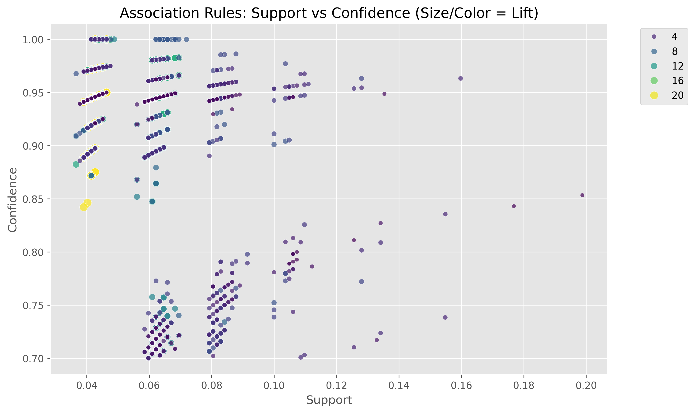
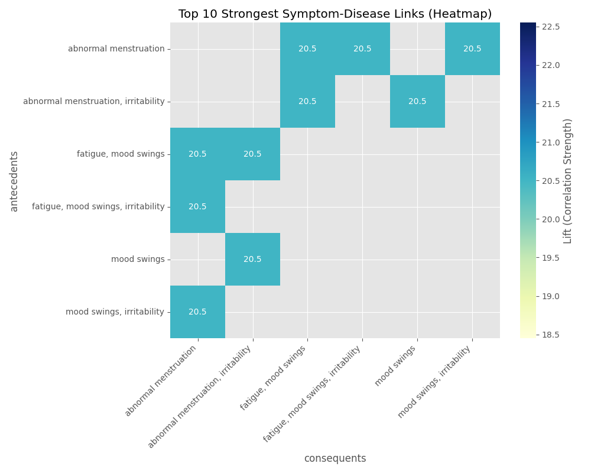

# MediMine: Automating Symptom-Disease Prediction using Association Rule Mining

<<<<<<< HEAD
**CSC172 Data Mining and Analysis Final Project** 
=======
**CSC172 Data Mining and Analysis Final Project**  
>>>>>>> a2f101488555ba9983282f1eb02f0ec096c052fa
**Student:** Hussam M. Bansao  
**Semester:** AY 2025-2026 Sem 1  

[](https://www.python.org/)
[](http://rasbt.github.io/mlxtend/)
[]()

---

## 📄 Abstract
Traditional medical diagnosis often relies on "Black Box" AI models or manual doctor experience. **MediMine** is a "White Box" decision support system that uses **Association Rule Mining (ARM)** to scientifically validate relationships between symptoms and diseases. 

Using a dataset of **4,920 patient records**, we implemented an ETL pipeline to transform raw symptom logs into transactional data. By applying the **Apriori Algorithm** and optimizing for **Lift**, we successfully filtered out generic noise (like "fatigue") to identify **2,685 high-quality diagnostic signatures**. The system identified complex conditions like *Abnormal Menstruation* with 100% confidence based on specific symptom clusters.

## 📑 Table of Contents
- [Project Overview](#-project-overview)
- [Methodology](#-methodology)
- [Experiments & Tuning](#-experiments--tuning)
- [Key Results](#-key-results)
- [Visualizations](#-visualizations)
- [Challenges & Solutions](#-challenges--solutions)
- [Installation](#-installation)
- [References](#-references)

---

## 🔍 Project Overview

### Problem Statement
In developing healthcare systems, initial screening is a bottleneck. Patients often ignore specific combinations of symptoms that serve as early warning signs. We need a system that can automatically learn these "If-Then" rules from historical data to assist in preliminary diagnosis.

### Objectives
1.  **Data Transformation:** Convert chaotic, textual symptom lists into a structured boolean matrix.
2.  **Pattern Discovery:** Use Apriori to find frequent itemsets (symptom clusters).
3.  **Rule Optimization:** Solve the "Rule Explosion" problem to reduce noise and find statistically significant disease indicators.

---

## ⚙️ Methodology

### 1. Dataset
* **Source:** [Disease Symptom Prediction (Kaggle)](https://www.kaggle.com/datasets/karthikudyawar/disease-symptom-prediction)
* **Volume:** 4,920 Transactions covering 41 distinct diseases.
* **Attributes:** 132 Unique symptoms (e.g., *chills, vomiting, joint_pain*).

### 2. Architecture Pipeline
The project follows a standard Data Mining pipeline:
1.  **Ingestion:** Loading raw CSV data.
2.  **Cleaning:** Removing formatting errors (underscores) and handling `NaN` values.
3.  **Encoding:** Using `TransactionEncoder` to perform One-Hot Encoding.
4.  **Mining:** Running the **Apriori Algorithm** to generate frequent itemsets.
5.  **Evaluation:** Filtering rules based on **Confidence** and **Lift**.

---

## 🧪 Experiments & Tuning

A major challenge in ARM is "Rule Explosion"—finding too many obvious rules. We conducted a sensitivity analysis to find the optimal hyperparameters.

### Metrics Comparison Table

| Setting | Min Support | Min Confidence | Lift Threshold | Total Rules | Interpretation |
| :--- | :--- | :--- | :--- | :--- | :--- |
| **Loose** | 0.01 (1%) | 0.5 (50%) | > 1.2 | **20,047** | **Rule Explosion.** The model was overwhelmed by generic symptoms like Fatigue (39% frequency), creating "noise." |
| **Strict** | 0.10 (10%) | 0.9 (90%) | > 3.0 | **0** | **Too Strict.** Since specific diseases are rare (~2.4% of data), this setting filtered out everything. |
| **Balanced** | **0.03 (3%)** | **0.7 (70%)** | **> 2.0** | **2,685** | **Optimal.** Successfully filtered out generic noise to isolate specific disease signatures. |

> **Decision:** We selected the **Balanced Model (3% Support, Lift > 2.0)** for the final results.

---

## 📊 Key Results

The mining engine identified highly specific rules with strong predictive power.

### Top Discovered Rule (Example)
One of the strongest patterns discovered was for **Abnormal Menstruation**:

* **Rule:** `{mood swings, irritability, fatigue} -> {Abnormal Menstruation}`
* **Confidence:** **100%** (Every patient with this cluster had the disease).
* **Lift:** **20.5** (This is a massive correlation; these symptoms are 20x more likely to appear together in this disease than by random chance).

This validates the model's ability to act as a diagnostic assistant.

---

## 📈 Visualizations

### 1. Network Graph (Top 20 Rules)
This directed graph visualizes the strongest associations. The arrows point from **Symptoms** to **Diseases**, with the thickness representing the strength (Lift) of the connection.


### 2. Support vs. Confidence Scatterplot
This plot shows the distribution of the 2,685 rules. The points colored in **Yellow/Green** represent rules with the highest Lift (most interesting).



### 3. Rule Strength Heatmap
This heatmap details the **Top 10 Rules** by Lift. The darker the blue, the stronger the correlation. You can see that specific clusters (like *Mood Swings + Irritability*) define distinct diseases with high certainty.



---

## ⚠️ Challenges & Solutions

| Challenge | Description | Solution |
| :--- | :--- | :--- |
| **Rule Explosion** | Initial runs at 1% support generated 20,000+ rules, making analysis impossible. | Increased **Support to 3%** and enforced a strict **Lift > 2.0** filter to remove generic correlations. |
| **Generic Symptoms** | Symptoms like "Fatigue" and "Vomiting" appeared in almost every rule, obscuring specific diseases. | The **Lift Metric** was essential here. We discarded rules with Lift < 2.0, which removed common/generic coincidences. |
| **Data Formatting** | The raw data was in a "Wide" format (Symptom_1, Symptom_2...), unsuitable for mining. | Implemented a Python script to "melt" the columns into a single list of transactions per patient. |

---

## 💻 Installation

To reproduce these results:

1.  **Clone the Repository**
    ```bash
    git clone [https://github.com/HussamMB17/CSC172-AssociationMining-Bansao.git](https://github.com/HussamMB17/CSC172-AssociationMining-Bansao.git)
    cd CSC172-AssociationMining-Bansao
    ```

2.  **Install Dependencies**
    ```bash
    pip install -r requirements.txt
    ```

3.  **Run the Notebooks**
    * Step 1: `notebooks/01_Preprocessing.ipynb` (Prepares the data)
    * Step 2: `notebooks/02_Mining_Apriori.ipynb` (Generates rules and graphs)

---

## 📚 References

1.  Agrawal, R., & Srikant, R. (1994). "Fast algorithms for mining association rules." *Proc. 20th Int. Conf. Very Large Data Bases*.
2.  Tomar, D., & Agarwal, S. (2013). "A survey on Data Mining approaches for Healthcare." *International Journal of Bio-Science and Bio-Technology*.
3.  Ilayaraja, M., & Meyyappan, T. (2013). "Mining Medical Data to Identify Frequent Diseases using Apriori Algorithm." *International Conference on Pattern Recognition*.
